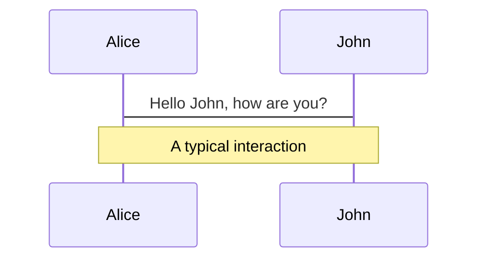
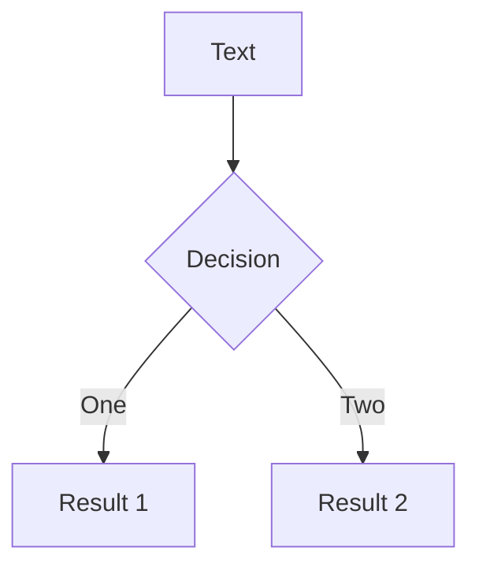
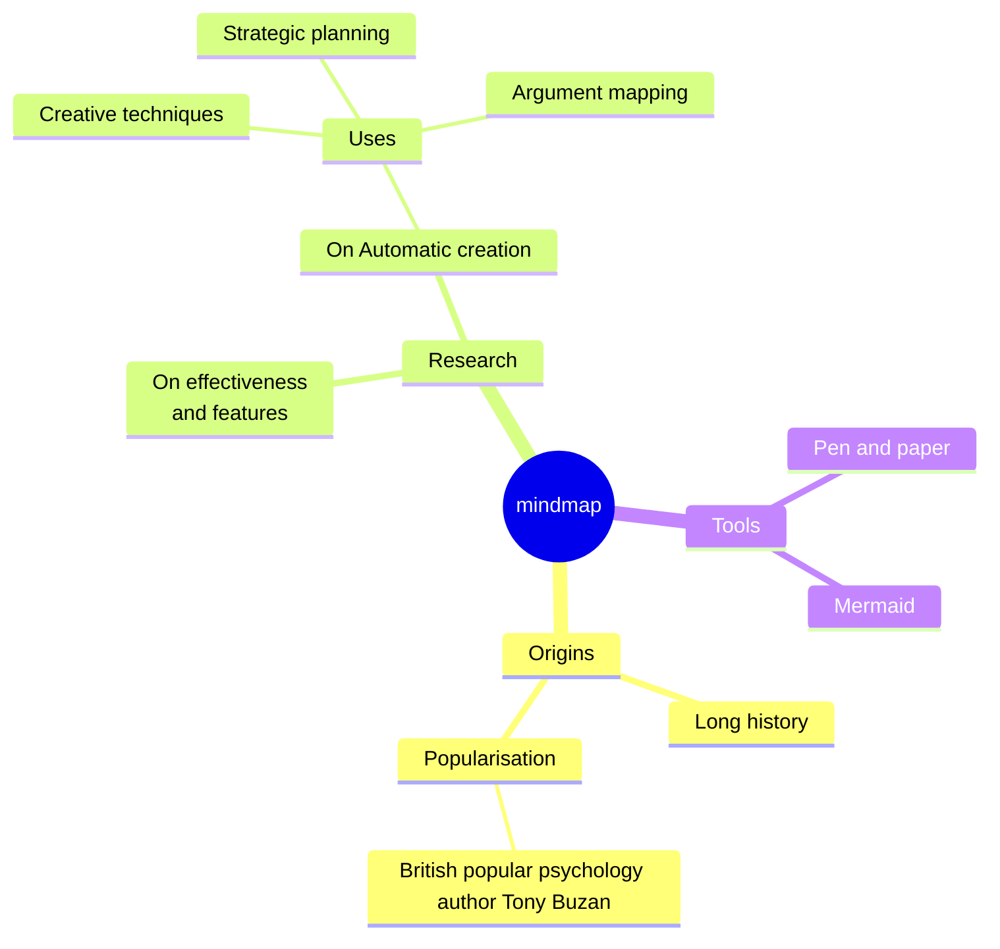
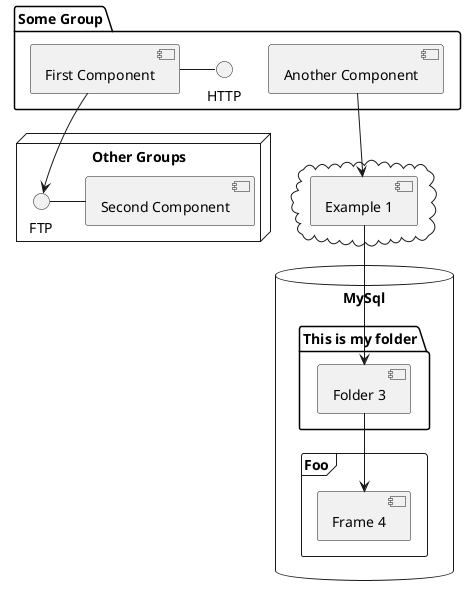

# AI is Here
<template>
  <footer class="absolute bottom-0 left-0 right-0 p-2">Your Name</footer>
</template>
<div class="flex items-center justify-center mb-8">
  <div class="mr-4">
    <carbon:code class="text-6xl text-blue-400" />
  </div>
  <div class="text-lg text-gray-300">Now What?</div>
</div>

<!-- <div class="flex justify-center mt-8 space-x-3">
  <div v-motion :initial="{ opacity: 0, y: 50 }" :enter="{ opacity: 1, y: 0, transition: { delay: 500 } }" class="feature-card px-3 py-3 rounded-lg">
    <carbon:code class="text-2xl mb-2 tech-icon" />
    <div class="text-sm font-medium">Code Review</div>
  </div>
  <div v-motion :initial="{ opacity: 0, y: 50 }" :enter="{ opacity: 1, y: 0, transition: { delay: 700 } }" class="feature-card px-3 py-3 rounded-lg">
    <carbon:test-tool class="text-2xl mb-2 tech-icon" />
    <div class="text-sm font-medium">Testing</div>
  </div>
  <div v-motion :initial="{ opacity: 0, y: 50 }" :enter="{ opacity: 1, y: 0, transition: { delay: 900 } }" class="feature-card px-3 py-3 rounded-lg">
    <carbon:debug class="text-2xl mb-2 tech-icon" />
    <div class="text-sm font-medium">Debugging</div>
  </div>
  <div v-motion :initial="{ opacity: 0, y: 50 }" :enter="{ opacity: 1, y: 0, transition: { delay: 1100 } }" class="feature-card px-3 py-3 rounded-lg">
    <carbon:task class="text-2xl mb-2 tech-icon" />
    <div class="text-sm font-medium">Requirements</div>
  </div>
  <div v-motion :initial="{ opacity: 0, y: 50 }" :enter="{ opacity: 1, y: 0, transition: { delay: 1300 } }" class="feature-card px-3 py-3 rounded-lg">
    <carbon:document class="text-2xl mb-2 tech-icon" />
    <div class="text-sm font-medium">Documentation</div>
  </div>
  <div v-motion :initial="{ opacity: 0, y: 50 }" :enter="{ opacity: 1, y: 0, transition: { delay: 1500 } }" class="feature-card px-3 py-3 rounded-lg">
    <carbon:education class="text-2xl mb-2 tech-icon" />
    <div class="text-sm font-medium">Learning</div>
  </div>
</div> -->

<div class="abs-br m-6 text-xl opacity-60">
  <button @click="$slidev.nav.openInEditor()" title="Open in Editor" class="slidev-icon-btn">
    <carbon:edit />
  </button>
</div>

<!--
The last comment block of each slide will be treated as slide notes. It will be visible and editable in Presenter Mode along with the slide. [Read more in the docs](https://sli.dev/guide/syntax.html#notes)
-->

---
layout: two-cols
transition: fade-out
class: ai-professional-bg standard-layout
---

# About Me

<div class="mb-6">
  <div class="text-3xl mb-2">👨‍💻</div>
  <div class="text-sm text-gray-300">From code to leadership, with AI as my copilot</div>
</div>

<div class="space-y-2">
  <div v-click class="flex items-center py-2 px-3 rounded bg-slate-800/30 border-l-4 border-blue-400">
    <div class="text-lg mr-3">🚀</div>
    <div class="text-base font-semibold text-blue-400">24 Years in Software Development</div>
  </div>

  <div v-click class="flex items-center py-2 px-3 rounded bg-slate-800/30 border-l-4 border-green-400">
    <div class="text-lg mr-3">⚙️</div>
    <div class="text-base font-semibold text-green-400">18 Years Backend & Data Engineering</div>
  </div>

  <div v-click class="flex items-center py-2 px-3 rounded bg-slate-800/30 border-l-4 border-purple-400">
    <div class="text-lg mr-3">🎯</div>
    <div class="text-base font-semibold text-purple-400">6 Years Engineering Management</div>
  </div>

  <div v-click class="flex items-center py-2 px-3 rounded bg-blue-900/30 border-l-4 border-yellow-400">
    <div class="text-lg mr-3">🤖</div>
    <div class="text-base font-semibold text-yellow-400">AI Integration Focus</div>
  </div>
</div>

::right::

<div class="h-full flex flex-col justify-center space-y-4">
  
  <div v-click class="ai-neural-bg rounded-lg p-4 text-center">
    <div class="text-4xl mb-2">🤖</div>
    <h3 class="text-white text-lg font-bold mb-3">The AI Journey</h3>
    <div class="space-y-2 text-sm">
      <div class="flex items-center justify-center text-orange-300">
        <div class="mr-2">📈</div>
        <span>Clueless → Excited & Still Clueless</span>
      </div>
      <div class="flex items-center justify-center text-green-300">
        <div class="mr-2">⚡</div>
        <span>10x the dopamine hits</span>
      </div>
      <div class="flex items-center justify-center text-blue-300">
        <div class="mr-2">🎯</div>
        <span>Something funny</span>
      </div>
    </div>
  </div>

  <div v-click class="bg-slate-800/40 rounded-lg p-4 border border-slate-600">
    <h4 class="text-white font-semibold mb-2 text-center">Current Tools</h4>
    <div class="grid grid-cols-2 gap-2 text-xs">
      <div class="bg-blue-900/30 rounded px-2 py-1 text-center text-blue-300">Claude</div>
      <div class="bg-green-900/30 rounded px-2 py-1 text-center text-green-300">ChatGPT</div>
      <div class="bg-purple-900/30 rounded px-2 py-1 text-center text-purple-300">Copilot</div>
      <div class="bg-orange-900/30 rounded px-2 py-1 text-center text-orange-300">Cursor</div>
    </div>
  </div>


</div>

---
layout: center
transition: fade-out
class: standard-layout
---

# Meet Our New AI Friend

<div class="text-center mb-2 mt-2">
  <div class="text-3xl mb-2">🤖</div>
  <div class="text-base text-gray-300">Understanding AI personality traits</div>
</div>

<div class="grid grid-cols-2 gap-2 max-w-4xl mx-auto">
  <div v-click="1" class="bg-gradient-to-br from-yellow-900/30 to-orange-900/30 rounded-lg p-2 border border-yellow-500/20">
    <div class="flex items-center mb-1">
      <div class="text-xl mr-2">🙏</div>
      <h3 class="text-sm font-bold text-yellow-400">Desperate to Please</h3>
    </div>
    <p class="text-gray-300 text-xs leading-tight">Will bend over backwards to help, even when it shouldn't. Like that coworker who says "yes" to everything.</p>
  </div>

  <div v-click="2" class="bg-gradient-to-br from-red-900/30 to-pink-900/30 rounded-lg p-2 border border-red-500/20">
    <div class="flex items-center mb-1">
      <div class="text-xl mr-2">💪</div>
      <h3 class="text-sm font-bold text-red-400">Over Confident</h3>
    </div>
    <p class="text-gray-300 text-xs leading-tight">Absolutely convinced it knows the answer, even when it's completely wrong. "I'm 100% sure this regex will work!"</p>
  </div>

  <div v-click="3" class="bg-gradient-to-br from-green-900/30 to-emerald-900/30 rounded-lg p-2 border border-green-500/20">
    <div class="flex items-center mb-1">
      <div class="text-xl mr-2">🎉</div>
      <h3 class="text-sm font-bold text-green-400">Over Enthusiastic</h3>
    </div>
    <p class="text-gray-300 text-xs leading-tight">Every task is THE MOST EXCITING THING EVER! "Let me help you refactor your entire codebase!"</p>
  </div>

  <div v-click="4" class="bg-gradient-to-br from-blue-900/30 to-cyan-900/30 rounded-lg p-2 border border-blue-500/20">
    <div class="flex items-center mb-1">
      <div class="text-xl mr-2">🎓</div>
      <h3 class="text-sm font-bold text-blue-400">Straight Out of School</h3>
    </div>
    <p class="text-gray-300 text-xs leading-tight">Knows all the theory, has read every documentation, but still asks "What's production like?" every five minutes.</p>
  </div>
</div>

<div v-click="5" class="mt-2 mb-16 text-center">
  <div class="bg-slate-800/40 rounded-lg p-2 border border-slate-600 inline-block">
    <p class="text-gray-300 text-sm">
      <span class="text-yellow-400">Sound familiar?</span> 
      It's like having a brilliant intern who never sleeps... or stops talking.
    </p>
  </div>
</div>

<!--
This slide introduces the AI personality in a humorous and relatable way, setting up the audience to understand AI limitations while keeping the tone light and engaging.
-->

---
transition: fade-out
layout: center
class: ai-circuit-bg standard-layout
---

# Ticket Refinement

<div class="text-center space-y-8">
  <div class="slide-header">
    <div class="flex items-center justify-center mb-6">
      <div class="text-4xl mr-3">🎫</div>
    </div>
    <div class="subtitle text-gray-300">It doesn't take much for an AI to be better than an engineer at this 😉</div>
  </div>

  <div v-click class="bg-gradient-to-br from-slate-800/50 to-slate-900/50 rounded-lg p-6 border border-slate-600 max-w-3xl mx-auto">
    <div class="text-lg text-yellow-400 mb-4 font-semibold">Let's be honest...</div>
    <div class="text-gray-300 text-base">
      How many tickets have you seen that just say "Fix the thing" or "Make it work better"? <br/>
      <span class="text-blue-400 font-medium">AI can turn those masterpieces into actual requirements!</span>
    </div>
  </div>

  <div v-click class="text-center">
    <div class="text-sm text-gray-400">
      Time to level up from "it's broken" to "here's exactly what needs to happen"
    </div>
  </div>
</div>

---
transition: fade-out
layout: two-cols
class: ai-circuit-bg standard-layout
---

# Improving Ticket Descriptions

## Before: The Classic Engineer Special

<div v-click class="bg-red-900/20 border border-red-500/30 rounded-lg p-2 mb-2">
  <div class="text-red-400 font-mono text-xs mb-1">TICKET-001</div>
  <div class="text-white font-semibold text-sm">Fix login bug</div>
  <div class="text-gray-400 text-xs">
    Description: "Users can't login sometimes. It's broken."
  </div>
</div>

## After: AI-Enhanced Clarity

<div v-click class="bg-green-900/20 border border-green-500/30 rounded-lg p-2">
  <div class="text-green-400 font-mono text-xs mb-1">TICKET-001</div>
  <div class="text-white font-semibold text-sm">Resolve intermittent authentication failures</div>
  <div class="text-gray-300 text-xs space-y-1">
    <p><strong>Issue:</strong> Users experience login failures ~15% of time</p>
    <p><strong>Impact:</strong> Affects user acquisition and retention</p>
    <p><strong>Scope:</strong> Auth service, session mgmt, error handling</p>
  </div>
</div>

::right::

<div class="space-y-3">
  <div v-click class="bg-slate-800/30 rounded-lg p-2 border border-slate-600">
    <h3 class="text-sm font-semibold text-blue-400 mb-1">AI Prompting Strategy</h3>
    <div class="text-xs text-gray-300">
      <p class="mb-1">"Analyze this ticket and provide:"</p>
      <ul class="list-disc list-inside space-y-0 ml-2 text-xs">
        <li>Clear problem statement</li>
        <li>Business impact</li>
        <li>Technical scope</li>
        <li>User journey context</li>
      </ul>
    </div>
  </div>

  <div v-click class="bg-slate-800/30 rounded-lg p-2 border border-slate-600">
    <h3 class="text-sm font-semibold text-purple-400 mb-1">Benefits</h3>
    <div class="text-xs text-gray-300">
      <div class="flex items-center">
        <span>• Reduces clarifications</span>
      </div>
      <div class="flex items-center">
        <span>• Improves estimation</span>
      </div>
      <div class="flex items-center">
        <span>• Better sprint planning</span>
      </div>
    </div>
  </div>
</div>

---
transition: fade-out
layout: center
class: ai-professional-bg standard-layout
---

# Acceptance Criteria Generation

<div class="text-center space-y-8">
  <div class="slide-header">
    <div class="flex items-center justify-center mb-6">
      <div class="text-4xl mr-3">✅</div>
    </div>
    <div class="subtitle text-gray-300">From description to definition of done</div>
  </div>

  <div class="grid grid-cols-1 md:grid-cols-2 gap-6 max-w-5xl mx-auto">
    <div v-click class="bg-gradient-to-br from-slate-800/40 to-slate-900/40 rounded-lg p-6 border border-slate-600">
      <h3 class="text-xl font-semibold text-blue-400 mb-4">Functional Criteria</h3>
      <div class="text-left space-y-2 text-sm text-gray-300">
        <div class="flex items-start">
          <span class="text-green-400 mr-2">✓</span>
          <span>User can successfully authenticate with valid credentials</span>
        </div>
        <div class="flex items-start">
          <span class="text-green-400 mr-2">✓</span>
          <span>Invalid credentials show appropriate error message</span>
        </div>
        <div class="flex items-start">
          <span class="text-green-400 mr-2">✓</span>
          <span>Session persists for configured timeout period</span>
        </div>
        <div class="flex items-start">
          <span class="text-green-400 mr-2">✓</span>
          <span>Failed attempts trigger rate limiting after 5 tries</span>
        </div>
      </div>
    </div>
    <div v-click class="bg-gradient-to-br from-slate-800/40 to-slate-900/40 rounded-lg p-6 border border-slate-600">
      <h3 class="text-xl font-semibold text-purple-400 mb-4">Non-Functional Criteria</h3>
      <div class="text-left space-y-2 text-sm text-gray-300">
        <div class="flex items-start">
          <span class="text-green-400 mr-2">✓</span>
          <span>Login response time < 2 seconds</span>
        </div>
        <div class="flex items-start">
          <span class="text-green-400 mr-2">✓</span>
          <span>Success rate > 99% under normal load</span>
        </div>
        <div class="flex items-start">
          <span class="text-green-400 mr-2">✓</span>
          <span>Passwords encrypted in transit and at rest</span>
        </div>
        <div class="flex items-start">
          <span class="text-green-400 mr-2">✓</span>
          <span>Accessible via keyboard navigation</span>
        </div>
      </div>
    </div>
  </div>

  <div v-click class="bg-yellow-900/20 border border-yellow-500/30 rounded-lg p-4 max-w-3xl mx-auto">
    <div class="text-yellow-400 font-semibold mb-2">💡 Pro Tip</div>
    <div class="text-gray-300 text-sm">
      AI can generate both happy path and edge case scenarios you might have missed. 
      It's like having a QA engineer review your requirements before development starts!
    </div>
  </div>
</div>

---
transition: fade-out
layout: two-cols
class: ai-circuit-bg standard-layout
---

# Test Requirements Planning

<div class="slide-header mb-6">
  <div class="flex items-center mb-4">
    <div class="text-3xl mr-3">🧪</div>
  </div>
  <div class="subtitle text-gray-300">Automated and manual testing roadmap</div>
</div>

## Automated Test Requirements

<div v-click class="space-y-3">
  <div class="bg-green-900/20 border border-green-500/30 rounded-lg p-3">
    <h4 class="text-green-400 font-semibold mb-2">Unit Tests</h4>
    <div class="text-sm text-gray-300 space-y-1">
      <div>• Authentication service methods</div>
      <div>• Password validation logic</div>
      <div>• Session token generation</div>
    </div>
  </div>

  <div class="bg-blue-900/20 border border-blue-500/30 rounded-lg p-3">
    <h4 class="text-blue-400 font-semibold mb-2">Integration Tests</h4>
    <div class="text-sm text-gray-300 space-y-1">
      <div>• Database connectivity</div>
      <div>• External OAuth providers</div>
      <div>• Rate limiting middleware</div>
    </div>
  </div>

  <div class="bg-purple-900/20 border border-purple-500/30 rounded-lg p-3">
    <h4 class="text-purple-400 font-semibold mb-2">E2E Tests</h4>
    <div class="text-sm text-gray-300 space-y-1">
      <div>• Complete login flow</div>
      <div>• Session management</div>
      <div>• Cross-browser compatibility</div>
    </div>
  </div>
</div>

::right::

## Manual Test Scenarios

<div v-click class="space-y-3">
  <div class="bg-orange-900/20 border border-orange-500/30 rounded-lg p-3">
    <h4 class="text-orange-400 font-semibold mb-2">Exploratory Testing</h4>
    <div class="text-sm text-gray-300 space-y-1">
      <div>• Unusual input combinations</div>
      <div>• Network interruption scenarios</div>
      <div>• Concurrent session handling</div>
    </div>
  </div>

  <div class="bg-red-900/20 border border-red-500/30 rounded-lg p-3">
    <h4 class="text-red-400 font-semibold mb-2">Security Testing</h4>
    <div class="text-sm text-gray-300 space-y-1">
      <div>• SQL injection attempts</div>
      <div>• Brute force protection</div>
      <div>• Session fixation attacks</div>
    </div>
  </div>

  <div class="bg-cyan-900/20 border border-cyan-500/30 rounded-lg p-3">
    <h4 class="text-cyan-400 font-semibold mb-2">Usability Testing</h4>
    <div class="text-sm text-gray-300 space-y-1">
      <div>• Error message clarity</div>
      <div>• Mobile responsiveness</div>
      <div>• Accessibility compliance</div>
    </div>
  </div>
</div>

<div v-click class="mt-6 bg-slate-800/30 rounded-lg p-4 border border-slate-600">
  <h4 class="text-yellow-400 font-semibold mb-2">🎯 Testing Strategy</h4>
  <div class="text-sm text-gray-300">
    AI can suggest the optimal test pyramid distribution: 70% unit, 20% integration, 10% E2E, 
    plus manual testing focus areas based on risk analysis.
  </div>
</div>

---
transition: fade-out
layout: center
class: ai-professional-bg standard-layout
---

# Before & After: Ticket Quality

<div class="space-y-8">
  <div class="slide-header text-center">
    <div class="flex items-center justify-center mb-6">
      <div class="text-4xl mr-3">🔄</div>
    </div>
    <div class="subtitle text-gray-300">Real ticket improvements with AI assistance</div>
  </div>

  <div class="grid grid-cols-1 lg:grid-cols-2 gap-8 max-w-6xl mx-auto">
    <!-- Before Column -->
    <div class="space-y-4">
      <h2 v-click class="text-xl font-semibold text-red-400 text-center">😬 Before</h2>
      <div v-click class="bg-red-900/20 border border-red-500/30 rounded-lg p-4">
        <div class="font-mono text-red-400 text-xs mb-2">TICKET-234</div>
        <div class="font-semibold text-white mb-2">Dashboard slow</div>
        <div class="text-gray-400 text-sm mb-4">Takes forever to load. Fix it.</div>
        <div class="space-y-2 text-xs">
          <div class="text-gray-500">Acceptance Criteria: Make it fast</div>
          <div class="text-gray-500">Test Plan: Click and see if it's faster</div>
        </div>
      </div>
      <div v-click class="bg-red-900/20 border border-red-500/30 rounded-lg p-4">
        <div class="font-mono text-red-400 text-xs mb-2">TICKET-456</div>
        <div class="font-semibold text-white mb-2">Button doesn't work</div>
        <div class="text-gray-400 text-sm mb-4">The submit button is broken sometimes.</div>
        <div class="space-y-2 text-xs">
          <div class="text-gray-500">Acceptance Criteria: Button works</div>
          <div class="text-gray-500">Test Plan: Test the button</div>
        </div>
      </div>
    </div>
    <!-- After Column -->
    <div class="space-y-4">
      <h2 v-click class="text-xl font-semibold text-green-400 text-center">✨ After</h2>
      <div v-click class="bg-green-900/20 border border-green-500/30 rounded-lg p-4">
        <div class="font-mono text-green-400 text-xs mb-2">TICKET-234</div>
        <div class="font-semibold text-white mb-2">Optimize dashboard load performance</div>
        <div class="text-gray-300 text-sm mb-4">
          <strong>Problem:</strong> Dashboard initial load time >8s affecting user engagement<br/>
          <strong>Impact:</strong> 23% user drop-off during dashboard loading<br/>
          <strong>Scope:</strong> API optimization, caching strategy, UI lazy loading
        </div>
        <div class="space-y-1 text-xs">
          <div class="text-green-300"><strong>AC:</strong> Load time <3s, lazy load widgets, error states</div>
          <div class="text-green-300"><strong>Tests:</strong> Performance, caching, error handling</div>
        </div>
      </div>
      <div v-click class="bg-green-900/20 border border-green-500/30 rounded-lg p-4">
        <div class="font-mono text-green-400 text-xs mb-2">TICKET-456</div>
        <div class="font-semibold text-white mb-2">Resolve form submission failures</div>
        <div class="text-gray-300 text-sm mb-4">
          <strong>Problem:</strong> Submit button becomes unresponsive in 12% of form submissions<br/>
          <strong>Trigger:</strong> Network timeouts, validation errors, concurrent requests<br/>
          <strong>User Impact:</strong> Data loss, frustration, duplicate submissions
        </div>
        <div class="space-y-1 text-xs">
          <div class="text-green-300"><strong>AC:</strong> Button state mgmt, timeout handling, validation feedback</div>
          <div class="text-green-300"><strong>Tests:</strong> Unit, integration, timeout simulation, accessibility</div>
        </div>
      </div>
    </div>
  </div>
</div>

---
transition: fade-out
layout: center
class: ai-circuit-bg standard-layout
---

# Practical Templates & Tips

<div class="space-y-8">
  <div class="slide-header text-center">
    <div class="flex items-center justify-center mb-6">
      <div class="text-4xl mr-3">📋</div>
    </div>
    <div class="subtitle text-gray-300">Prompts and workflows for consistent ticket quality</div>
  </div>
  <div class="grid grid-cols-1 lg:grid-cols-2 gap-8 max-w-6xl mx-auto">
    <div v-click class="bg-slate-800/40 rounded-lg p-6 border border-slate-600">
      <h3 class="text-xl font-semibold text-blue-400 mb-4">🤖 AI Prompt Template</h3>
      <div class="bg-slate-900/50 rounded p-4 text-sm font-mono text-gray-300">
        <div class="text-green-400 mb-2"># Ticket Enhancement Prompt</div>
        <div class="space-y-1">
          <div>Analyze this ticket: "[PASTE_TICKET]"</div>
          <div>&nbsp;</div>
          <div>Provide:</div>
          <div>1. Clear problem statement</div>
          <div>2. Business impact assessment</div>
          <div>3. Technical scope & dependencies</div>
          <div>4. Acceptance criteria (functional & non-functional)</div>
          <div>5. Testing strategy (auto + manual)</div>
          <div>6. Risk assessment & edge cases</div>
        </div>
      </div>
    </div>
    <div v-click class="bg-slate-800/40 rounded-lg p-6 border border-slate-600">
      <h3 class="text-xl font-semibold text-purple-400 mb-4">⚡ Quick Workflow</h3>
      <div class="space-y-3">
        <div class="flex items-start">
          <div class="w-6 h-6 bg-purple-500 text-white rounded-full flex items-center justify-center text-xs mr-3 mt-0.5">1</div>
          <div class="text-sm">
            <div class="font-semibold text-white">Paste original ticket</div>
            <div class="text-gray-400">Into AI chat with enhancement prompt</div>
          </div>
        </div>
        <div class="flex items-start">
          <div class="w-6 h-6 bg-purple-500 text-white rounded-full flex items-center justify-center text-xs mr-3 mt-0.5">2</div>
          <div class="text-sm">
            <div class="font-semibold text-white">Review & refine</div>
            <div class="text-gray-400">AI suggestions with domain knowledge</div>
          </div>
        </div>
        <div class="flex items-start">
          <div class="w-6 h-6 bg-purple-500 text-white rounded-full flex items-center justify-center text-xs mr-3 mt-0.5">3</div>
          <div class="text-sm">
            <div class="font-semibold text-white">Update ticket system</div>
            <div class="text-gray-400">Copy enhanced content back to JIRA/etc</div>
          </div>
        </div>
        <div class="flex items-start">
          <div class="w-6 h-6 bg-purple-500 text-white rounded-full flex items-center justify-center text-xs mr-3 mt-0.5">4</div>
          <div class="text-sm">
            <div class="font-semibold text-white">Team review</div>
            <div class="text-gray-400">Validate with stakeholders</div>
          </div>
        </div>
      </div>
    </div>
  </div>
  <div v-click class="bg-yellow-900/20 border border-yellow-500/30 rounded-lg p-6 max-w-4xl mx-auto">
    <div class="text-center">
      <div class="text-yellow-400 font-semibold text-lg mb-2">🎯 Result</div>
      <div class="text-gray-300">
        Transform 5-minute "quick tickets" into comprehensive, testable, estimatable work items. <br/>
        <span class="text-blue-400 font-medium">Your future self (and your team) will thank you.</span>
      </div>
    </div>
  </div>
</div>

---
transition: fade-out
layout: two-cols
class: ai-circuit-bg standard-layout
---

# AI-Powered Presentations

<div class="slide-header">
  <div class="flex items-center mb-6">
    <div class="text-4xl mr-3">🧠</div>
    <div class="subtitle">Just like our AI friend, modern presentation tools are getting smarter</div>
  </div>
</div>

<div class="content-section">
  Slidev represents the evolution of developer presentations:

  - 🤖 **AI-Assisted** - leverage AI for content creation and code examples  
  - 📝 **Text-based** - focus on content with Markdown, style with AI suggestions
  - 🎨 **Intelligent Theming** - AI-optimized themes and color schemes
  - 🧑‍💻 **Developer Friendly** - code highlighting with AI-powered explanations
  - 🤹 **Interactive** - embed Vue components enhanced by AI workflows
  - 🎥 **Smart Recording** - AI-assisted presentation recording and editing
  - 📤 **Multi-format Export** - AI-optimized exports for different platforms
  - 🛠 **Infinitely Hackable** - combine with AI tools for unlimited possibilities
</div>

::right::

<div class="sidebar-highlight">
  <div class="ai-neural-bg h-full flex flex-col justify-center items-center rounded-lg p-8">
    <div class="text-6xl mb-6">⚡</div>
    <h3 class="text-white text-center mb-4">The AI Advantage</h3>
    <div class="text-white/80 text-sm text-center space-y-2">
      <div>🔍 Instant code analysis</div>
      <div>✨ Smart content suggestions</div> 
      <div>🎯 Automated formatting</div>
      <div>🚀 Rapid prototyping</div>
    </div>
  </div>
</div>

<!--
You can have `style` tag in markdown to override the style for the current page.
Learn more: https://sli.dev/features/slide-scope-style
-->

<style>
h1 {
  background-color: #2B90B6;
  background-image: linear-gradient(45deg, #4EC5D4 10%, #146b8c 20%);
  background-size: 100%;
  -webkit-background-clip: text;
  -moz-background-clip: text;
  -webkit-text-fill-color: transparent;
  -moz-text-fill-color: transparent;
}
</style>

<!--
Here is another comment.
-->

---
# Standard Content Layout - Information Display
transition: slide-up
level: 2
layout: default
class: standard-layout content-slide
---

<div class="slide-header">
  <h1>Navigation</h1>
  <div class="subtitle">Master the presentation controls</div>
</div>

<div class="content-section">
  <div class="info-callout mb-6">
    <div class="flex items-center">
      <carbon:information class="text-2xl mr-3 text-blue-400" />
      <span>Hover on the bottom-left corner to see the navigation's controls panel, <a href="https://sli.dev/guide/ui#navigation-bar" target="_blank">learn more</a></span>
    </div>
  </div>

  <div class="section-block">
    <h2>Keyboard Shortcuts</h2>
    
    <div class="shortcuts-grid">
      <div class="shortcut-item">
        <div class="shortcut-keys">
          <kbd>→</kbd> / <kbd>space</kbd>
        </div>
        <div class="shortcut-desc">next animation or slide</div>
      </div>
      <div class="shortcut-item">
        <div class="shortcut-keys">
          <kbd>←</kbd> / <kbd>shift</kbd><kbd>space</kbd>
        </div>
        <div class="shortcut-desc">previous animation or slide</div>
      </div>
      <div class="shortcut-item">
        <div class="shortcut-keys">
          <kbd>↑</kbd>
        </div>
        <div class="shortcut-desc">previous slide</div>
      </div>
      <div class="shortcut-item">
        <div class="shortcut-keys">
          <kbd>↓</kbd>
        </div>
        <div class="shortcut-desc">next slide</div>
      </div>
    </div>
  </div>
</div>

<!-- https://sli.dev/guide/animations.html#click-animation -->

<p v-after class="absolute bottom-23 left-45 opacity-30 transform -rotate-10">Here!</p>

---
layout: two-cols
layoutClass: gap-16
---

# Table of contents

You can use the `Toc` component to generate a table of contents for your slides:

```html
<Toc minDepth="1" maxDepth="1" />
```

The title will be inferred from your slide content, or you can override it with `title` and `level` in your frontmatter.

::right::

<Toc text-sm minDepth="1" maxDepth="2" />

---
layout: two-cols
class: ai-code-bg
---

# AI-Enhanced Code

<div class="flex items-center mb-4">
  <div class="text-3xl mr-3">💡</div>
  <div>AI transforms how we write, review, and understand code</div>
</div>

Experience the power of AI-assisted development:

```ts [filename-example.ts] {all|4|6|6-7|9|all} twoslash
// TwoSlash enables TypeScript hover information
// and errors in markdown code blocks
// More at https://shiki.style/packages/twoslash
import { computed, ref } from 'vue'

const count = ref(0)
const doubled = computed(() => count.value * 2)

doubled.value = 2
```

<arrow v-click="[4, 5]" x1="350" y1="310" x2="195" y2="342" color="#953" width="2" arrowSize="1" />

<!-- This allow you to embed external code blocks -->
<<< @/snippets/external.ts#snippet

<!-- Footer -->

[Learn more](https://sli.dev/features/line-highlighting)

<!-- Inline style -->
<style>
.footnotes-sep {
  @apply mt-5 opacity-10;
}
.footnotes {
  @apply text-sm opacity-75;
}
.footnote-backref {
  display: none;
}
</style>

<!--
Notes can also sync with clicks

[click] This will be highlighted after the first click

[click] Highlighted with `count = ref(0)`

[click:3] Last click (skip two clicks)
-->

---
level: 2
---

# Shiki Magic Move

Powered by [shiki-magic-move](https://shiki-magic-move.netlify.app/), Slidev supports animations across multiple code snippets.

Add multiple code blocks and wrap them with <code>````md magic-move</code> (four backticks) to enable the magic move. For example:

````md magic-move {lines: true}
```ts {*|2|*}
// step 1
const author = reactive({
  name: 'John Doe',
  books: [
    'Vue 2 - Advanced Guide',
    'Vue 3 - Basic Guide',
    'Vue 4 - The Mystery'
  ]
})
```

```ts {*|1-2|3-4|3-4,8}
// step 2
export default {
  data() {
    return {
      author: {
        name: 'John Doe',
        books: [
          'Vue 2 - Advanced Guide',
          'Vue 3 - Basic Guide',
          'Vue 4 - The Mystery'
        ]
      }
    }
  }
}
```

```ts
// step 3
export default {
  data: () => ({
    author: {
      name: 'John Doe',
      books: [
        'Vue 2 - Advanced Guide',
        'Vue 3 - Basic Guide',
        'Vue 4 - The Mystery'
      ]
    }
  })
}
```

Non-code blocks are ignored.

```vue
<!-- step 4 -->
<script setup>
const author = {
  name: 'John Doe',
  books: [
    'Vue 2 - Advanced Guide',
    'Vue 3 - Basic Guide',
    'Vue 4 - The Mystery'
  ]
}
</script>
```
````

---

# Components

<div grid="~ cols-2 gap-4">
<div>

You can use Vue components directly inside your slides.

We have provided a few built-in components like `<Tweet/>` and `<Youtube/>` that you can use directly. And adding your custom components is also super easy.

```html
<Counter :count="10" />
```

<!-- ./components/Counter.vue -->
<Counter :count="10" m="t-4" />

Check out [the guides](https://sli.dev/builtin/components.html) for more.

</div>
<div>

```html
<Tweet id="1390115482657726468" />
```

<Tweet id="1390115482657726468" scale="0.65" />

</div>
</div>

<!--
Presenter note with **bold**, *italic*, and ~~striked~~ text.

Also, HTML elements are valid:
<div class="flex w-full">
  <span style="flex-grow: 1;">Left content</span>
  <span>Right content</span>
</div>
-->

---
class: px-20
---

# Themes

Slidev comes with powerful theming support. Themes can provide styles, layouts, components, or even configurations for tools. Switching between themes by just **one edit** in your frontmatter:

<div grid="~ cols-2 gap-2" m="t-2">

```yaml
# frontmatter
theme: default
# end frontmatter
```

```yaml
# frontmatter  
theme: seriph
# end frontmatter
```


</div>

Read more about [How to use a theme](https://sli.dev/guide/theme-addon#use-theme) and
check out the [Awesome Themes Gallery](https://sli.dev/resources/theme-gallery).

---

# Clicks Animations

You can add `v-click` to elements to add a click animation.

<div v-click>

This shows up when you click the slide:

```html
<div v-click>This shows up when you click the slide.</div>
```

</div>

<br>

<v-click>

The <span v-mark.red="3"><code>v-mark</code> directive</span>
also allows you to add
<span v-mark.circle.orange="4">inline marks</span>
, powered by [Rough Notation](https://roughnotation.com/):

```html
<span v-mark.underline.orange>inline markers</span>
```

</v-click>

<div mt-20 v-click>

[Learn more](https://sli.dev/guide/animations#click-animation)

</div>

---

# Motions

Motion animations are powered by [@vueuse/motion](https://motion.vueuse.org/), triggered by `v-motion` directive.

```html
<div
  v-motion
  :initial="{ x: -80 }"
  :enter="{ x: 0 }"
  :click-3="{ x: 80 }"
  :leave="{ x: 1000 }"
>
  Slidev
</div>
```

<div class="w-60 relative">
  <div class="relative w-40 h-40">
    
    
    
  </div>

  <div
    class="text-5xl absolute top-14 left-40 text-[#2B90B6] -z-1"
    v-motion
    :initial="{ x: -80, opacity: 0}"
    :enter="{ x: 0, opacity: 1, transition: { delay: 2000, duration: 1000 } }">
    Slidev
  </div>
</div>

<!-- vue script setup scripts can be directly used in markdown, and will only affects current page -->
<script setup lang="ts">
const final = {
  x: 0,
  y: 0,
  rotate: 0,
  scale: 1,
  transition: {
    type: 'spring',
    damping: 10,
    stiffness: 20,
    mass: 2
  }
}
</script>

<div
  v-motion
  :initial="{ x:35, y: 30, opacity: 0}"
  :enter="{ y: 0, opacity: 1, transition: { delay: 3500 } }">

[Learn more](https://sli.dev/guide/animations.html#motion)

</div>

---

# LaTeX

LaTeX is supported out-of-box. Powered by [KaTeX](https://katex.org/).

<div h-3 />

Inline $\sqrt{3x-1}+(1+x)^2$

Block
$$ {1|3|all}
\begin{aligned}
\nabla \cdot \vec{E} &= \frac{\rho}{\varepsilon_0} \\
\nabla \cdot \vec{B} &= 0 \\
\nabla \times \vec{E} &= -\frac{\partial\vec{B}}{\partial t} \\
\nabla \times \vec{B} &= \mu_0\vec{J} + \mu_0\varepsilon_0\frac{\partial\vec{E}}{\partial t}
\end{aligned}
$$

[Learn more](https://sli.dev/features/latex)

---

# Diagrams

You can create diagrams / graphs from textual descriptions, directly in your Markdown.

<div class="grid grid-cols-4 gap-5 pt-4 -mb-6">









</div>

Learn more: [Mermaid Diagrams](https://sli.dev/features/mermaid) and [PlantUML Diagrams](https://sli.dev/features/plantuml)

---
foo: bar
dragPos:
  square: 691,32,167,_,-16
---

# Draggable Elements

Double-click on the draggable elements to edit their positions.

<br>

###### Directive Usage

```md

```

<br>

###### Component Usage

```md
<v-drag text-3xl>
  <div class="i-carbon:arrow-up" />
  Use the `v-drag` component to have a draggable container!
</v-drag>
```

<v-drag pos="663,206,261,_,-15">
  <div text-center text-3xl border border-main rounded>
    Double-click me!
  </div>
</v-drag>


###### Draggable Arrow

```md
<v-drag-arrow two-way />
```

<v-drag-arrow pos="67,452,253,46" two-way op70 />

---
src: ./pages/imported-slides.md
hide: false
---

---

# Monaco Editor

Slidev provides built-in Monaco Editor support.

Add `{monaco}` to the code block to turn it into an editor:

```ts {monaco}
import { ref } from 'vue'
import { emptyArray } from './external'

const arr = ref(emptyArray(10))
```

Use `{monaco-run}` to create an editor that can execute the code directly in the slide:

```ts {monaco-run}
import { version } from 'vue'
import { emptyArray, sayHello } from './external'

sayHello()
console.log(`vue ${version}`)
console.log(emptyArray<number>(10).reduce(fib => [...fib, fib.at(-1)! + fib.at(-2)!], [1, 1]))
```

---
layout: center
class: text-center
---

# Learn More

[Documentation](https://sli.dev) · [GitHub](https://github.com/slidevjs/slidev) · [Showcases](https://sli.dev/resources/showcases)

<PoweredBySlidev mt-10 />

<style src="./style.css"></style>
